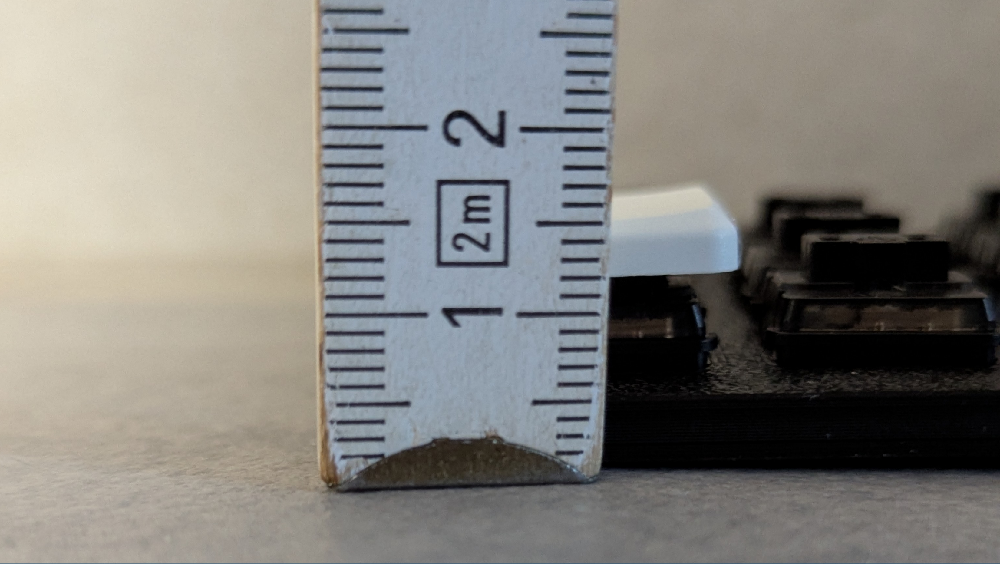

# Disclaimer

The files in this repository are meant as inspiration for others who want to build a keyboard from scratch as well. You can build the keyboard yourself with the files provided here but be aware that it's not beginner friendly. The MCU is soldered directly on the PCB, the power connection from the PCB to the XIAO needs to be soldered manually, there is not reset button (you'll need to short GND and RST on the exposed XIAO) and the battery is soldered direclty onto the PCB as well. 

# Building a keyboard from scratch

The text below describes my journey of using and building ergonomic keyboards. If you're thinking about building a keyboard yourself, it might help you to read what decisions I took and why. Or maybe your just nerdy and want to read how others ended up in the rabbit hole of ergonomic keyboards. Either way, I hope you find the text interesting and learn a thing or two about ergonomic keyboards.

## First steps

My ergonomic keyboard journey started with the Kinesis Advantage 2, many many years ago (I think around 2015, but I'm not sure). I didn't have any wrist pain or other health issues, but being a software engineer I was aware that I'll sit in front of a computer and type for many more years to come, so why not try something new that can potentially make it more comfortable.
But I didn't just want to switch to an ergonomic keyboard, I also warted to learn a new layout. Why you might ask? I don't remember. I have a tendency to go all-in on those kind of things. Like, when I switched from Windows to Linux and I decided to go with Arch Linux and a tiling window manager, but that's a different story. I knew about Dvorak, I learend about other layouts like Colemak and Workman but none of seemed right for me. This was mainly for two reasons: 1. As a software engineer I often use symbols like brackets, simicolon, etc. and 2. my native languege is German, which has umlauts. Eventually I found the [Neo-layout](https://neo-layout.org), which supported everything I needed, symobols, umlauts and even more. I'm still using the [Neo-layout](https://neo-layout.org) today, eventhough there are more modern variants of it like [Bone](https://neo-layout.org/Layouts/bone/).

### Using an ergonomic keyboard for the first time
Using the Kinesis Advantage 2 for the first time was harder than expected. Especially since I started using it with the Neo-layout right away. To not impact my speed at work, I started to only use the Kinesis in the evening when learning the new layout. Due to the different phyiscial keyboards, switching back and forth between my regular keyboard with QUERZ and the Kinesis with Neo was surprisingly easy. Once I got the basics, I started to use the Kinesis when working on hobby projects to get more productive when writing actual code and eventually I completely switched to Neo and the Kinesis.

### Switching to the ZSA moonlander
After using the Kinesis for years, I wanted something more compact that I could also take with me in my backpack. Technically one can do that with the Kinesis too and I did it a few times, but it's really bulky. In 2020 ZSA released the [Moonlander](https://www.zsa.io/moonlander), which I bought in 2021. I love the design and the quality. When initially using it, I missed the key wells that the Kiesis has, but typing was still comfortable and the thumb cluster that is also used for tenting worked well for my hands. Having the palm rests integrated into they keyboard is great too.

### Experimenting with layouts
Besides the key wells, I also missed the 6 key thumb clusters the Kinesis has. Time to think about my layout again. The main issue I had was that I couldn't have all the modifiers on the thumb cluster. I ended up keeping control and the meta key (a.k.a. Windows key) on the thumb cluster, since those are my most used modifiers (CTRL for shortcuts and the meta key when using my window manager i3). This is the layout I used: https://configure.zsa.io/moonlander/layouts/MJal0/GLZ5R/0/34/. It's from 2020, even though according to the confirmation e-mail I bought the Moonlander in 2021. I might have started to experiment with layouts even before I bought it to test if it works for me.

### Home row mods
In 2021 I learned about home row mods and I was excited. Having the modifiers right at my fingertips, sounds awnesome. My first layout using home row mods looked like this: https://configure.zsa.io/moonlander/layouts/MJal0/EKRjn/0 (just using CTRL). I flashed the firmware, started writing and it felt very clunky, I had false positives and false negatives and couldn't really get used to using home row mods. I tried a couple of options, but nothing seemed to work, so I gave up and flashed my old firmware again.

### Home row mods - round 2
In 2023 I decided to try home row mods again (not really sure why). I read the excellent ["A guide to home row mods"](https://precondition.github.io/home-row-mods) and started to experiment with different tapping terms and other options that [Oryx](https://configure.zsa.io/) exposes. I ended up with this layout: https://configure.zsa.io/moonlander/layouts/MJal0/qRXQK/0. This time home row mods worked well enough that I kept using them and I still use home row mods today in 2025.

## More pre-build keyboards
### Corne
After starting a new job in 2023 where I work both in the office and from home, I initially took my Moonlander to the office and back home every day. And even though the Moonlander is more portable than the Kinesis Advantage, I started looking for a new keyboard that I'd use at home. ZSA just released their [Voyager](https://www.zsa.io/voyager) which seemed ideal, small, less keys, low profile (something I wanted to try for a while). But I like to compare different options when buying things I use every day, so I didn't buy it right away. For months I researched, compared it to the other well known brands like the [Glove80](https://www.moergo.com), the [Kinesis Advantage 360](https://kinesis-ergo.com/keyboards/advantage360/) and many others. Around that time I found the [ErgoMechKeyboards subreddit](https://www.reddit.com/r/ErgoMechKeyboards/) which opened up a whole new world of possibilities. Meaning that it made my decision even harder.

I already reduced the number of keys that I used on my Moonlander, so something like a 42 key keyboard seemed like the right option. Since I was quite new to this and didn't want to solder it myself (I didn't even have a soldering iron at the time), I decided to go with something popular and pre-build and after a short conversation with their fantastic support I ordered a Corne from [KeebMaker](https://keebmaker.com).

I made couple of mistakes (they're all fully on me and have nothing to do with the service KeebMaker provides):

1. I chose the wireless option but still went with OLED displays per key LEDs. I was fully aware that both the OLED displays and the LEDs would drain the battery real quick, but I though I can use it both wireless and wired (via two USB cables, not via TRRS). Simply because I wanted to have all the options available. The displays and LEDs can be turend off in ZMS and after tweaking the power setting the battery life was ok (2-3 days of full use for the primary half) but I wanted to get at least 1 full week.
2. I didn't take into account that the size of my hands actually matters that much. With both the Kisesis and the Moonlander the thumb clusters "just worked" for me. The most inner thumb key was pretty much inacessible for me. And even the normal thumb keys weren't working well. I was the first time when using a split keyboard that I developed minor pain in my right thumb.

I tried to mitigate the thumb issue by using lighter switches: 35g Kailh Red Pro, the 20g Kailh Choc Light Blue were too light and I had too many accidental triggers. After that I tried different tenting solutions, like using (SmallRig Camps)[https://www.smallrig.com/smallrig-multi-functional-crab-shaped-clamp-with-ballhead-magic-arm-2164.html] to mount the keyboard to my desk. Changing my keymap to put less stress on my thumbs partially worked but I didn't like any of the options and went back to my original layout.

Along the way I also tried to understand the root cause of the thumb issues I hand and found Pascal's excellent summary: [PSA: Thumbs can get overuse injuries](https://getreuer.info/posts/keyboards/thumb-ergo/index.html). He uses a [keyboard layout](https://github.com/getreuer/qmk-keymap) where none of the tap holds to switch layers in on the thumb. For me switching to the symbol layer with a none-dedicated key never properly worked. In the end I decided to look for a new keyboard with a better thumb cluster position.

### Piantor Pro

From my experience with the Corne, I knew that my next keyboard needed to have a thumb cluster that is further towards the center (more to the right for the left hand and vice versa), since I struggled to use the inner most thumb key (the one that is basically under your palm). I also needed at least 3x6 keys, due to my layout having to support German umlauts and even though that I by now was fairly comfortable with homerow mods, still using a dedicated shift key when typing. In addition to that it should also have a more agressive pinky stagger. Fairly early in my quest for my next keyboard, I found [the Piantor Pro](https://shop.beekeeb.com/product/pre-soldered-piantor-split-keyboard/) which one can get pre-build (I was still afraid to solder myself). I dismissed it for a couple of weeks, since it doesn't have a display. Having a display is helpful for me to know what layer I'm on especially when using non momentary layers, e.g. for gaming. It's also helpful to know which bluetooth profile I'm currently connected to, but since this keyboard is wired, that wouldn't be a problem. It's not a must have, but very handy. The next nice to have is ZMK/wireless. For me, home row mods worked much better on ZMK (using a lot of the settings from [urob's zmk-config - Timeless homerow mods](https://github.com/urob/zmk-config#timeless-homerow-mods)) than on QMK (even with tweaks like Pascal's [Achordion](https://getreuer.info/posts/keyboards/achordion/index.html)). The low profile of the Coren worked well for me, since I never found comfortable palm rests other than the ones that come with the Moonlander, which are attached to the keyboard and feel well positioned. Long story short, after weeks of research I ended up buying the Piantor Pro, since it was the closest I could get to my ideal setup.
The service that [beekeeb](https://shop.beekeeb.com/) was great. I placed my order on July 20th 2024, the keyboard was shipped on August 4th 2024 and arrived on August 9th in Switzerland. Besides the keyboard, the package also contained two USB-C cables (one to connect the two halves and one to connect the keyboard to your device), some spare key cabs and even a few spare switches and some rubber feet with minimal hight (very handy). The build quality is outstanding and the keyboard looks very clean. Again great experience ordering from a small ergonomic keyboard shop.

This keyboard worked way better for the size of my hands. Having the thumb keys further towards the center meant that I could keep by thums in a more natural position when typing. The pinky stagger also made more of a difference than I expected. But of course there were things I didn't like. The main issues was still the position and shape of the thumb keys. One reason I like typing on my Moonlander is that it has big thums keys (2u) that I can hit well with the whole side of my thumb. When typing on the Piantor I noticed that I hit the thumb keys at an angle due to them being only 1u (the same size as regular keys).

But what now? I already spent hours and hours to find my perfect keyboard, does it even exist? Remember that I said I tend to go all-in on certain things? After being afraid of soldering myself I thought that if I'm going for yet another keyboard, then I'll build it from scratch and so I did.

## Bulding my own keyboard

I'm not going to describe how one builds a keyboard from scratch, other people already did this very well. The most helpful resource on this was [FlatFootFox's Let's Design A Keyboard With Ergogen v4](https://flatfootfox.com/ergogen-introduction/). It's a step by step guide that explains how to design a PCB from scratch in ergogen, design the case and route everything in KiCAD. It doesn't cover reversible PCBs and some other details that I needed, but was a increadibly helpful starting point. If I'm going to describle the process of building my own keyboard, it will not be part if this text, since this text mainly describes my experience and thought process of how I got were I currently am.

#### The design phase

There are a couple of things that I learned from the previous keyboards that I owned:

- 40-42 keys is what works best for me
- Low profile because I haven't yet found a good tenting solution and/or the right tenting angle and the flatter the keyboard is the more comfortable it is to type on when it's not tented
- Wireless, but with a decent battery life (I used the nice!nano controller)
- Run ZMK, since HRM worked best with the options that ZMK supported (although QMK is catching up)
- Displays will be helpful, especially for debuggig when it comes to connectivity (I used nice!view displays)

With that in mind I started to design my own keyboard in ergogen folloing FlatFootFox's tutorial. Using the online version is very handy, since one can see in real time how the result looks. https://ergogen.xyz/ is the official web based one, but there is also https://ergogen.ceoloide.com/ and https://ergogen.cache.works/ (probably more, but those are the ones I used).

Since I knew nothing about building custom keyboards, I stared simple, just designing one half (the keyboard in the tutorial is not split). I first read all the steps and then started agin, this time following along by applying the described steps to my own keyboard. This took quite a bit of time, especially the routing part was hard for me to grasp at first, but after a couple of tries I had a fully routed PCB. It was only the left half, it was not reversible and it wasn't yet in the exact way I wanted it to be, but it it should be functionial if I didn't scew-up. I orderd the PCP via https://www.pcbway.com/. This way I could use it to test my design, learn to solder and make sure I have everything covered.

Now that I had the PCB, I wanted to make sure the design fits my hand (that's one of the main reasons why I considered building a keyboard from scratch). Because I knew that I'll have to iterate on the design and that I wanted to print the case myself, I ordered a 3D printer, the Bambu Lab A1 mini. I could have used a service to print the case, but being able to print the case, put some switches in it and test that way was super helpful. But before I started 3D printing, I printed the outlines on paper. This is much faster to get to roughly the correct shape and distribution of the keys. For me especially the tumb positon was tricky. After having an approximation of what I wanted in 2D, I 3D printed the case. I printed *lots* of prototypes until I was satisfied with the result.

#### Building half of it
In the meantime, the PCB of my left half arrived (actually 5 PCBs since that's the minimal amount you can order). I used a combination of parts that I salvaged from pre-built boards that I had (e.g. Nice!Nano controllers) and parts that I ordered (hot-swap sockets, diodes, etc.). This way I could also learn desoldering components.
Besides the parts for the keyboard, I also needed all the tooling to solder, like the soldering iron, multi-meter (absolutely essential), etc. I started soldering on the balkony since I didn't have a soldering smoke absorber/filter. After the first evening doing so, I ordered a soldering smoke absorber. This was an December and it was roughly 0 degrees celcius (which is 32 Fahreinheit those weird people who use the imperial unit system - no offense).
After many issues (and even more swear words), I had a working left half of my keyboard. Here's what I learned:

- just try, don't be afraid of breaking things (and make sure you can affort to break things because you'll very likely going to break things)
- make sure you solder components with right orientation (especially diods, but also the controller ;-))
- have a multimeter to check your soldering (really, without it, it's almost impossilbe to find issues)
- make sure you have enough time and be patient and keep trying (I made lots of mistakes, but I'm also very stubborn and just kept trying, understanding where the problem could be, narrowing it down, finding it, fixing it)

#### Setting up ZMK (for half a keyboard)
When I wrote that I now had a working version, then that's only half the truth. I had half a keyboard that made my multimeter beep when I pressed a key and I've tested each key, but it didn't yet work with a computer. Because now that the hardware is in place, the next important component is firmware, in this case ZMK. What it does is, it translates the signals from the keyboard, like pins are active, into something a computer can understand.
ZMK's documentation is really good, the [Hardware Integration](https://zmk.dev/docs/development/hardware-integration) page describes the main components that are needed for a new keyboard. Another source of information is looking for keyboards that run ZMK as well and are open source. Gitub tags are very helpful to find those. Because there are constantly new features and the formats sometimes change (incl. breaking changes), it's worth looking at some of the most recent examples.
At this point I didn't bother to setup a physical layout that can be used with ZMK studio, more on that later though.
What I didn't like when setting up a keyboard in ZMK were the error messages. Those were a bit hit or miss. Some of them clearly pointed to the config that was the problem, but some of them didn't give me any clear direction of what to look for. As with most problems, I'd recommend getting a very basic version running and then incrementally changing it to your needs.

#### Make the PCB reversible
Now that I had a working version of half my keyboard I wanted to make it reversible. This allows me to order one PBC that I can use for both halves. Just make it work both ways, easy right? Well, let me tell you that it wasn't easy for me. But once you unterstand how the keyboard matrix actully works, it becomes mainly a challenge of how to get the routing done. Luckily the footprints I used from ergogen already supported reversible PCBs this helped a lot, especially for the sockets and the controller.
I don't have a step by step guide to describe how to build a reversible PCB since a lot will depend on the components that are used. As described above, what helped the most was using footprints (the "building blocks" of the PCB) that are reversible in ergogen. If the footprints are reversible then the "Design Rules Checker" in KiCAD can show you what connects you're missing for routing.
Another change was to cut out a rectangle to support a bigger battery without making the case thicker. I don't remember where I got the idea from, but after going through my bookmarks, my inspiration probably was the [Lintilla](https://github.com/ctranstrum/lintilla).

#### Let's make it more difficult - adding encoders
But why stop there? As part of my research I found boards that had rotary encoders and thought: Nice, those have to be very handy for scrolling or to controle the volume. So I decided to add them as well. Which meant I had two more problems:
1. How to wire them (luckily the nice!nano has enough pins to support encoders)
2. I wanted to use EVQWGD001, which are no longer produced and pretty hard to get since they're sold out in most shops

To help with 1., there's a very good description on github: [EVQWGD001-Pinout](https://github.com/rroels/EVQWGD001-Pinout). For two, I can't remember where I bought them, but I was able to find some. I later found out that there's now a very low cost (~ 1USD) DIY version: [MEH01](https://github.com/EverydayErgo/MEH01).

#### The first full board
With that I had my first full board:
* 40 keys, 2 encoders
* PCB: reversible, designed in ergogen and ordered via PCBWay
* Controller: nice!nano
* Displays: nice!view
* 200 mAh battery
* Hotswap Sockets
* Kailh Choc Red switches (50g, linear, choc v1)
* Choc spacing

After a bit more debugging (mistakes during soldering and figuring out how encoders work in ZMK), I finally had my first fully functioning split keyboard that I designed myself.

The first version of the keyboard with EVQWGD001 encoders and Nice!View displays:

#### Using the v1 prototype

I used it for roughtly 5 months and then decided that I needed to design another one because:

* I didn't like the look of the displays on the keyboard (I wanted to have them flush with the case, which I wasn't able to do)
* The displays used too much battery (even though they're already a lot better than OLED displays)
* The battery was too small
* I liked the design of the Piantor because it's so clean

That's when I decided to use a dongle. This would allow me to have better battery life (the dongle those the heavy lifting instead of the left half).

I also experimented a lot with tenting solutions:

* integrating a MagSafe magnet into the case and using [phone stands](https://eu.ugreen.com/en-ch/products/ugreen-magsafe-360-adjustable-phone-stand) to tilt the keyboard
* using [camera clamp mounts](https://www.smallrig.com/global/list/Super-Clamp.html) with a [Magnetic Mount Adapts Tripod](https://www.jjc.cc/index/goods/detail.html?id=1336) to tilt the keyboard
* using either version with and without [wrist rests](https://www.fellowes.com/uk/en/catalog/workspace-ergonomics/ergonomic-accessories/details/wrist-rests/UK-9112301)

I wasn't able to find the ideal tenting angle that would feel comfortable and all of those setups weren't stable enough for me. There's plenty of people reporting that either of these solutions work for them and are rock solid, but they didn't work well for me. Besides the stability problems I also had issues with my thumb. It started to hurt when using the keyboard at an angle. It felt like the thumb keys were too high and the angle at which I hit them/the movement I had to do with my thumb was putting more strain to my thumb than when the keyboard was flat.
That's when I found Pascal Getreuer's [PSA: Thumbs can get overuse injuries](https://getreuer.info/posts/keyboards/thumb-ergo/index.html), which I highly recommend to read. Those learnings lead to more changes in my keyboard layout. I initially made heavy use of layer switches and meta keys on my thumbs. Those keys are typically held while pressing another switch. I removed almost all of them from my thumb cluster and moved them to other fingers.

Due to tenting not working for me I got obsessed with making the keyboard flatter. Since tenting wasn't working for me and neither did wrist rests, I accepted that the pronation of my forearms will not be ideal and optimized for the remaining things:
* the split takes care of the ulnar deviation
* a flat keyboard means less wrist extension even when used without wrist rests and without hovering while typing
* lighter switches mean less force is needed to press each switch
* [Ripple Thumb Keycaps](https://github.com/nmunnich/ripple-thumb-keycaps) for the thumbs instead of standard 1.5u keys

Besides the ergo aspects I also optimized some of the technical aspects:
* increased battery life by moving the displays from the keyboard to a dongle
* increased battery life by using a bigger battery
* removing the encoders since I didn't use them much
* switching to Seeed Studio XIAO nRF52840 for the smaller footprint (it's also cheaper)

#### Bulding the v2 prototype - make it flatter

The build process of the v2 was fairly straight forward, since I had existing design. The main work was to update it to the Seeed XIAO's pinout. But there were two additional challanges with that:

1. The XIAO's footprint didn't work on the latest KiCAD
2. The XIAO footprint is reversible, but puts the routing right below the MCU

The first was in [easy fix](https://github.com/ceoloide/ergogen-footprints/pull/56), for which I provided the changes upstream. The second one was harder. I needed to cut out the part below the MCU from the PCB to be able to make the board whole flatter. To do so I needed to move the routing to the side instead of the MCU. I took me quite some time to figure out how to modify the footprint to support this. The changes is so custom (and ugly) that I only kept it on [my own](https://github.com/exul/ergogen-footprints/) fork of the [ergogen-footprints](https://github.com/ceoloide/ergogen-footprints) repository.

When manufactoring the keyboard I also decided to go with 1mm thickness instead of the standard 1.6mm. I didn't think about the fact that this could cause issues with the hotswap sockets. Luckily everything worked it the end.

I also modified the case to have holes for the hotwap sockets and the diodes (I saw this on the [TOTEM](https://github.com/GEIGEIGEIST/TOTEM)). To do this directy in ergogen I took the socket design that Chad created for his [Charlieflex keyboard](https://github.com/ctranstrum/chuck).

With all those modifications I was able to get to a key hight of 1.5cm and a case hight of 0.5cm.

The v2 with the initial version of the case that is just 0.5cm high:

The v2 on my desk with the dongle below the screen and a newer version of the case:

#### The second full board
With that I had my first full board:
* 40 keys, no encoders
* PCB: reversible, designed in ergogen and ordered via PCBWay
* Controller: Seeed Studio XIAO nRF52840
* Dongle: [Prospector](https://github.com/carrefinho/prospector) later switched to [ZMK Dongle Screen YADS (Yet another Dongle Screen)](https://github.com/janpfischer/zmk-dongle-screen), which is heavily inspired by the Prospector
* 500 mAh battery
* Hotswap Sockets
* Ambients Silent Choc Switches: Nocturnal [Low Profile Switches](https://lowprokb.ca/products/ambients-silent-choc-switches?variant=44873446391972) (20g, choc v1) and [Twilight Low Profile Switches](https://lowprokb.ca/products/ambients-silent-choc-switches) (35g, linear, choc v1), I used the Twilight switches after trying both since the Nocturnals where too light for me
* Choc spacing
* [Ripple Thumb Keycaps](https://github.com/nmunnich/ripple-thumb-keycaps) for the thumbs

#### Using the v2 prototype

I used this version of the keyboard for about 6 months. But as you might have guessed I identified some issues. Because the board was so thin, the stability of the board was bad. The solered hotswap sockets caused the PCB to bend slightly and the very thin case didn't help either. I also took the thinness of the case unreasonably far, since even though it was just 0.5cm the switches did stick out about 1mm, meaning to have a case that would actually fit the switches would be 0.6cm. And while the Ambients Silent Choc Switches where a huge improvement over the reds, I was still looking for better options. I liked the low travel distance of the check switches, but I still prefered the overall feel of MX switches. It was time to try choc v2 switches as they seemed to be the best mix of the two worlds.
When typing a lot I sometimes hit neightbouring keys by accident. I'm not sure if that's because of my big hands or due to the light switches, but I decided to change the spacing to MX spacing, which would also make it easier to find keycaps.

Optimizations for v3:
* choc v2 switches
* slightly adjusted thumb position
* thicker PCB for stability
* MX spacing

#### Bulding the v3 prototype - make it thicker

Since the footprint for the switches that I used was already compatible with choc v2 switches I didn't have to change much. I printed a couple of cases to test the thumb position and had to adjust the bottom of the case for the v2 choc switches and that was about it.

The v2 on my desk with the dongle below the screen:

#### The second full board
With that I had my first full board:
* 40 keys, no encoders
* PCB: reversible, designed in ergogen and ordered via PCBWay
* Controller: Seeed Studio XIAO nRF52840
* Dongle: [ZMK Dongle Screen YADS (Yet another Dongle Screen)](https://github.com/janpfischer/zmk-dongle-screen)
* 500 mAh battery
* Hotswap Sockets
* Choc v2 Switches: Kailh Deep Sea Silent Mini (50g, linear, choc v2), they felt too heavy and I ordered Kailh Purple Swallowtail Mini (30g, Linear) and Kailh Deep Sea Mini Pink Island Silent (35g, linear)
* MX spacing
* [Ripple Thumb Keycaps](https://github.com/nmunnich/ripple-thumb-keycaps) for the thumbs