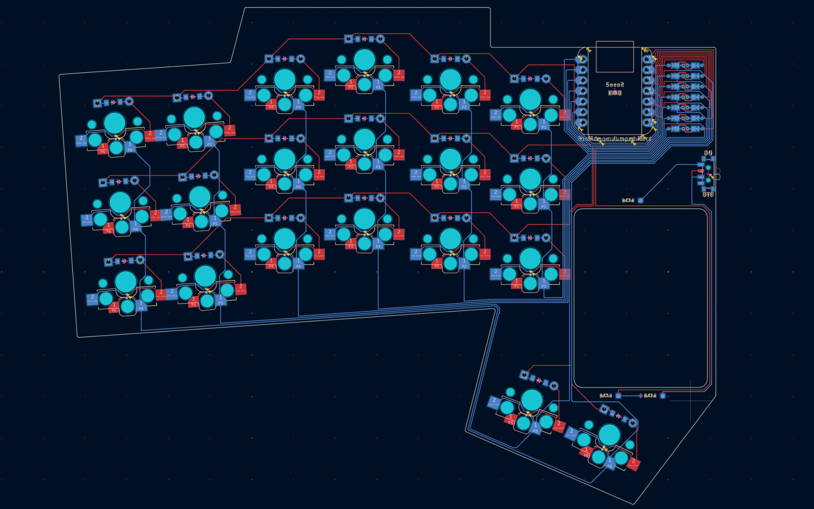

# Building a keyboard from scratch

## Building my own keyboard

I'm not going to describe how one builds a keyboard from scratch, other people already did this very well. The most helpful resource on this was [FlatFootFox's Let's Design A Keyboard With Ergogen v4](https://flatfootfox.com/ergogen-introduction/). It's a step-by-step guide that explains how to design a PCB from scratch in Ergogen, design the case and route everything in KiCAD. It doesn't cover reversible PCBs and some other details that I needed, but was an incredibly helpful starting point.

### The design phase

There are a couple of things that I learned from the previous keyboards that I own:

- 40-42 keys is what works best for me
- Low profile because I haven't yet found a good tenting solution and/or the right tenting angle and the flatter the keyboard is the more comfortable it is to type on when it's not tented
- Wireless, but with a decent battery life (I used the Nice!Nano controller)
- Run ZMK, since HRM worked best with the options that ZMK supported (although QMK is catching up)
- Displays will be helpful, especially for debugging when it comes to connectivity (I used Nice!View displays)

With that in mind, I started to design my own keyboard in Ergogen following FlatFootFox's tutorial. Using the online version is very handy, since one can see in real time how the result looks. https://ergogen.xyz/ is the official web based one, but there are also https://ergogen.ceoloide.com/ and https://ergogen.cache.works/ (probably more, but those are the ones I used).

Since I knew nothing about building custom keyboards, I stared simple, just designing one half (the keyboard in the tutorial is not split). I first read all the steps and then started again, this time following along by applying the described steps to my own keyboard. This took quite a bit of time, especially the routing part was hard for me to grasp at first, but after a couple of tries I had a fully routed PCB. It was only the left half, it was not reversible, and it wasn't yet in the exact way I wanted it to be, but it should be functional if I didn't screw-up. I ordered the PCP via https://www.pcbway.com/. This way I could use it to test my design, learn to solder and make sure I have everything covered.

Now that I had the PCB, I wanted to make sure the design fits my hand (that's one of the main reasons why I considered building a keyboard from scratch). Because I knew that I'll have to iterate on the design and that I wanted to print the case myself, I ordered a 3D printer, the Bambu Lab A1 mini. I could have used a service to print the case, but being able to print the case, put some switches in it and test that way was super helpful. But before I started 3D printing, I printed the outlines on paper. This is much faster to get to roughly the correct shape and distribution of the keys. For me especially, the thumb position was tricky. After having an approximation of what I wanted in 2D, I 3D printed the case. I printed *lots* of prototypes until I was satisfied with the result.

I also cut out a rectangle on the PCB to support a bigger battery without making the case thicker. I don't remember where I got the idea from, but after going through my bookmarks, my inspiration probably was the [Lintilla](https://github.com/ctranstrum/lintilla).

Some test prints (sorry for the plastic waste):

### Building half of it
In the meantime, the PCB of my left half arrived (actually 5 PCBs since that's the minimal amount you can order). I used a combination of parts that I salvaged from pre-built boards that I had (e.g. Nice!Nano controllers) and parts that I ordered (hot-swap sockets, diodes, etc.). This way I could also learn desoldering components.
Besides the parts for the keyboard, I also needed all the tooling to solder, like the soldering iron, multi-meter (absolutely essential), etc. I started soldering on the balcony since I didn't have a soldering smoke absorber/filter. After the first evening doing so, I ordered a soldering smoke absorber. This was in December and it was roughly 0 degrees Celsius (which is 32 Fahrenheit those weird people who use the imperial unit system - no offense).
After many issues (and even more swear words), I had a working left half of my keyboard. Here's what I learned:

- just try, don't be afraid of breaking things (and make sure you can afford to break things because you're very likely going to break things)
- make sure you solder components with the right orientation (especially diodes, but also the controller ;-))
- have a multimeter to check your soldering (really, without it, it's almost impossible to find issues)
- make sure you have enough time and be patient and keep trying (I made lots of mistakes, but I'm also very stubborn and just kept trying, understanding where the problem could be, narrowing it down, finding it, fixing it)

The left half (non-reversible PCB):

### Setting up ZMK (for half a keyboard)
When I wrote that I now had a working version, then that's only half the truth (pun intended). I had half a keyboard that made my multimeter beep when I pressed a key, and I've tested each key, but it didn't yet work with a computer. Because now that the hardware is in place, the next important component is firmware, in this case ZMK. What it does is, it translates the signals from the keyboard, like pins are active, into something a computer can understand.
ZMK's documentation is really good, the [Hardware Integration](https://zmk.dev/docs/development/hardware-integration) page describes the main components that are needed for a new keyboard. Another source of information is looking for keyboards that run ZMK as well and are open source. Gitub tags are very helpful to find those. Because there are constantly new features and the formats sometimes change (incl. breaking changes), it's worth looking at some of the most recent examples.
At this point I didn't bother to set up a physical layout that can be used with ZMK studio, more on that later though.
What I didn't like when setting up a keyboard in ZMK were the error messages. Those were a bit hit or miss. Some of them clearly pointed to the config that was the problem, but some of them didn't give me any clear direction of what to look for. As with most problems, I'd recommend getting a very basic version running and then incrementally changing it to your needs.

### Make the PCB reversible
Now that I had a working version of half my keyboard, I wanted to make it reversible. This allows me to order one PBC that I can use for both halves. Just make it work both ways, easy, right? Well, let me tell you that it wasn't easy for me. But once you understand how the keyboard matrix actually works, it becomes mainly a challenge of how to get the routing done. Luckily the footprints I used from Ergogen already supported reversible PCBs, this helped a lot, especially for the sockets and the controller.
I don't have a step-by-step guide to describe how to build a reversible PCB, since a lot will depend on the components that are used. As described above, what helped the most was using footprints (the "building blocks" of the PCB) that are reversible in Ergogen. If the footprints are reversible, then the "Design Rules Checker" in KiCAD can show you what connections you're missing.

### Let's make it more difficult - adding encoders
But why stop there? As part of my research I found boards that had rotary encoders and thought: Nice, those have to be very handy for scrolling or to control the volume. So I decided to add them as well. Which meant I had two more problems:
1. How to wire them (luckily the Nice!Nano has enough pins to support encoders)
2. I wanted to use the EVQWGD001, which are no longer produced and pretty hard to get since they're sold out in most shops

To help with 1., there's a very good description on GitHub: [EVQWGD001-Pinout](https://github.com/rroels/EVQWGD001-Pinout). For two, I can't remember where I bought them, but I was able to find some. I later found out that there's now a very low cost (~ 1USD) DIY version: [MEH01](https://github.com/EverydayErgo/MEH01).

### The first full board
With that I had my first full board:
* 40 keys, 2 encoders
* PCB: reversible, designed in Ergogen and ordered via PCBWay
* Controller: Nice!Nano
* Displays: Nice!View
* 200 mAh battery
* Hotswap Sockets
* Kailh Choc Red switches (50g, linear, choc v1)
* Choc spacing

After a bit more debugging (mistakes during soldering and figuring out how encoders work in ZMK), I finally had my first fully functioning split keyboard that I designed myself.

The first version of the keyboard with EVQWGD001 encoders and Nice!View displays:

### Using the v1 prototype

I used it for roughly 5 months and then decided that I needed to design another one because:

* I didn't like the look of the displays on the keyboard (I wanted to have them flush with the case, which I wasn't able to do)
* The displays used too much battery (even though they're already a lot better than OLED displays)
* The battery was too small
* I liked the design of the Piantor because it's so clean

That's when I decided to use a dongle. This would allow me to have better battery life (the dongle does the heavy lifting instead of the left half).

I also experimented a lot with tenting solutions:

* integrating a MagSafe magnet into the case and using [phone stands](https://eu.ugreen.com/en-ch/products/ugreen-magsafe-360-adjustable-phone-stand) to tilt the keyboard
* using [camera clamp mounts](https://www.smallrig.com/global/list/Super-Clamp.html) with a [Magnetic Mount Adapts Tripod](https://www.jjc.cc/index/goods/detail.html?id=1336) to tilt the keyboard
* using either version with and without [wrist rests](https://www.fellowes.com/uk/en/catalog/workspace-ergonomics/ergonomic-accessories/details/wrist-rests/UK-9112301)

I wasn't able to find the ideal tenting angle that would feel comfortable, and all of those setups weren't stable enough for me. There's plenty of people reporting that either of these solutions work for them and are rock solid, but they didn't work well for me. Besides the stability problems, I also had issues with my thumb. It started to hurt when using the keyboard at an angle. It felt like the thumb keys were too high and the angle at which I hit them/the movement I had to do with my thumb was putting more strain on my thumb than when the keyboard was flat.

Due to tenting not working for me, I got obsessed with making the keyboard flatter. I accepted that the pronation of my forearms will not be ideal and optimized for the remaining things:
* the split takes care of the ulnar deviation
* a flat keyboard means less wrist extension even when used without wrist rests and without hovering while typing
* lighter switches mean less force is needed to press each switch
* [Ripple Thumb Keycaps](https://github.com/nmunnich/ripple-thumb-keycaps) for the thumbs instead of standard 1.5u keys

Besides the ergo aspects I also optimized some of the technical aspects:
* increased battery life by moving the displays from the keyboard to a dongle
* increased battery life by using a bigger battery
* removing the encoders since I didn't use them much
* switching to Seeed Studio XIAO nRF52840 for the smaller footprint (it's also cheaper)

### Building the v2 prototype - make it flatter

The build process of the v2 was fairly straight forward, since I had an existing design. The main work was to update it to the Seeed XIAO's pinout. But there were two additional challenges with that:

1. The XIAO's footprint didn't work on the latest KiCAD
2. The XIAO footprint is reversible, but puts the routing right below the MCU

The first was an [easy fix](https://github.com/ceoloide/ergogen-footprints/pull/56), for which I provided the changes upstream. The second one was harder. I needed to cut out the part below the MCU from the PCB to be able to make the board flatter. To do so, I needed to move the routing to the side of the MCU. I took me quite some time to figure out how to modify the footprint to support this. The changes are so custom (and ugly) that I only kept them on [my own fork](https://github.com/exul/ergogen-footprints/) of the [ergogen-footprints](https://github.com/ceoloide/ergogen-footprints) repository.

When manufacturing the keyboard, I also decided to go with 1mm thickness instead of the standard 1.6mm. I didn't think about the fact that this could cause issues with the hotswap sockets. Luckily, everything worked it the end.

I also modified the case to have holes for the hotswap sockets and the diodes (I saw this on the [TOTEM](https://github.com/GEIGEIGEIST/TOTEM)). To do this directly in Ergogen I took the socket design that Chad created for his [Charlieflex keyboard](https://github.com/ctranstrum/chuck).

With all those modifications, I was able to get to a key height of 1.5cm and a case height of 0.5cm.

The v2 with the initial version of the case that is just 0.5cm high:

The v2 on my desk with the dongle below the screen and a newer version of the case:

### The second full board
With that I had my second full board:
* 40 keys, no encoders
* PCB: reversible, designed in Ergogen and ordered via PCBWay
* Controller: Seeed Studio XIAO nRF52840
* Dongle: [Prospector](https://github.com/carrefinho/prospector) later switched to [ZMK Dongle Screen YADS (Yet another Dongle Screen)](https://github.com/janpfischer/zmk-dongle-screen), which is heavily inspired by the Prospector
* 500 mAh battery
* Hotswap Sockets
* Ambients Silent Choc Switches: [Nocturnal Low Profile Switches](https://lowprokb.ca/products/ambients-silent-choc-switches?variant=44873446391972) (20g, choc v1) and [Twilight Low Profile Switches](https://lowprokb.ca/products/ambients-silent-choc-switches) (35g, linear, choc v1), I used the Twilight switches after trying both since the Nocturnals where too light for me
* Choc spacing
* [Ripple Thumb Keycaps](https://github.com/nmunnich/ripple-thumb-keycaps) for the thumbs

### Using the v2 prototype

I used this version of the keyboard for about 6 months. But as you might have guessed I identified some issues. Because the board was so thin, the stability of the board was bad. The soldered hotswap sockets caused the PCB to bend slightly and the very thin case didn't help either. I took the thinness of the case unreasonably far, since even though it was just 0.5cm the switches did stick out about 1mm, meaning to have a case that would actually fit the switches would be 0.6cm in height. And while the Ambient Silent Choc Switches where a huge improvement over the reds, I was still looking for better options. I liked the low travel distance of the choc switches, but I still preferred the overall feel of MX switches. It was time to try choc v2 switches as they seemed to be the best mix of the two worlds.
When typing a lot I sometimes hit neighboring keys by accident. I'm not sure if that's because of my big hands or due to the light switches, but I decided to change the spacing to MX spacing, which would also make it easier to find keycaps.

Optimizations for v3:
* choc v2 switches
* slightly adjusted thumb position
* thicker PCB for stability
* MX spacing

### Building the v3 prototype - make it thicker

Since the footprint for the switches that I used was already compatible with choc v2 switches, I didn't have to change much. I printed a couple of cases to test the thumb position and had to adjust the bottom of the case for the v2 choc switches and that was about it.

The v2 on my desk with the dongle below the screen:

### The second full board
With that I had my third full board:
* 40 keys, no encoders
* PCB: reversible, designed in Ergogen and ordered via PCBWay
* Controller: Seeed Studio XIAO nRF52840
* Dongle: [ZMK Dongle Screen YADS (Yet another Dongle Screen)](https://github.com/janpfischer/zmk-dongle-screen)
* 500 mAh battery
* Hotswap Sockets
* Choc v2 Switches: Kailh Deep Sea Silent Mini (50g, linear, choc v2), they felt too heavy and I ordered Kailh Purple Swallowtail Mini (30g, Linear) and Kailh Deep Sea Mini Pink Island Silent (35g, linear)
* MX spacing
* [Ripple Thumb Keycaps](https://github.com/nmunnich/ripple-thumb-keycaps) for the thumbs

The v3 right half with 3x 1 Euro coins stacked up which is ~7mm (this includes the rubber feet):

The v3 bottom side:

v3 routing:

### Was it worth it?

Yes, absolutely, but also: It depends. My main motivation was and is that it's fun building keyboards and experimenting with layouts. In terms of ergonomics, I'm not sure. There are so many factors and I'm not convinced that smaller keyboards are necessary better. Less physical keys mean less movement of the fingers, but it also means more layers are needed. What I see a lot is that this is done via holding down one of the thumb keys, which can cause issues as well. PSA: Thumbs can get overuse injuries
](https://getreuer.info/posts/keyboards/thumb-ergo/index.html) has a very good description of the involved anatomy even though it's not a scientific paper/study. I do have pain in my right thumb from time to time, but then so does a colleague who is using a standard keyboard. In the end, typing less and moving more is probably what helps most. If you have health problems, ask a doctor and figure out what works for you.

### What's next?

I already have a couple of things that I want to improve/try:

- an angled thumb cluster (like the one that the Moonlander has)
- a track point as part of the keyboard
- use MX switches(?)

But first I'm going to use this version for a while :-).

Besides that, I'm probably going to give [Magic Sturdy](https://github.com/Ikcelaks/keyboard_layouts/blob/main/magic_sturdy/magic_sturdy.md) a try.